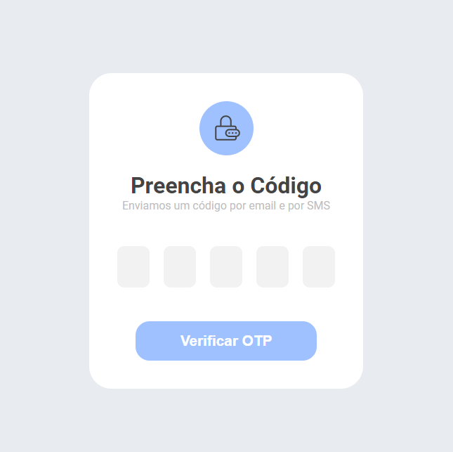

# ListaCompras
``` 
✨ Este projeto foi desenvolvido com o objetivo de aplicar meus conhecimentos 
em React, TypeScript e SCSS.
``` 



## Experiências Práticas
Durante o desenvolvimento deste projeto, notei que melhorei minhas habilidades de construção de interface utilizando React com Typescript e SCSS. Porém, tive dificuldade em implementar a lógica responsável por alterar o campo focado após o usuário inserir um número.

Diante dessa dificuldade, resolvi pesquisar um pouco sobre como fazer essa ação e consegui encontrar as funções .previousSibling e .nextSibling, que são responsáveis por capturar o elemento anterior e o próximo elemento, respectivamente. A partir disso, bastava evocar a função focus() para focar no elemento. Após esse importante aprendizado, pude concluir o projeto.


## 🔨 Requisitos
- Crie um formulário com 5 campos de entrada, cada um representando um dígito da senha OTP.
- A submissão desse formulário deverá ocorrer quando o usuário pressionar a tecla Enter ou clicar no botão de submissão.
- Os campos de entrada só poderão aceitar números, permitindo apenas um único dígito em cada.
- Ao carregar a página, a aplicação deverá focar no primeiro campo de dígito.
- Ao digitar no primeiro campo, o foco deve ser transferido automaticamente para o segundo campo, e assim sucessivamente.
- Se algum dígito for apagado, o foco deve retornar para o dígito anterior.
- ~~ Deve ser possível colar um código de 5 dígitos e ele deve aparecer corretamente nos campos de entrada. ~~
- Um erro deve ser exibido quando o texto colado não possuir 5 dígitos numéricos.
- A navegação entre os campos deve ser possível utilizando as setas do teclado (ArrowLeft e ArrowRight).
- Em dispositivos móveis, o teclado numérico deve ser ativado (ao invés do teclado tradicional).
- Utilize, sempre que possível, as boas práticas descritas nesse artigo.
- Desenvolva a interface de usuário conforme o modelo do Figma ou, se preferir, crie um design personalizado.

## 👉🏽 Sobre este mini-projeto
### O que você irá praticar:
#### React
- Refs no React
- Formulários controlados no React
- Eventos
#### WebOTP API
- Melhores práticas no uso da WebOTP API
- Inputs com teclados numéricos

### Pré-requisitos
Conhecimento básico de React (JSX, componentes, props)

<a href='https://codante.io/mini-projetos/formulario-de-otp-com-react'>DESAFIO [CODANTE]</a>